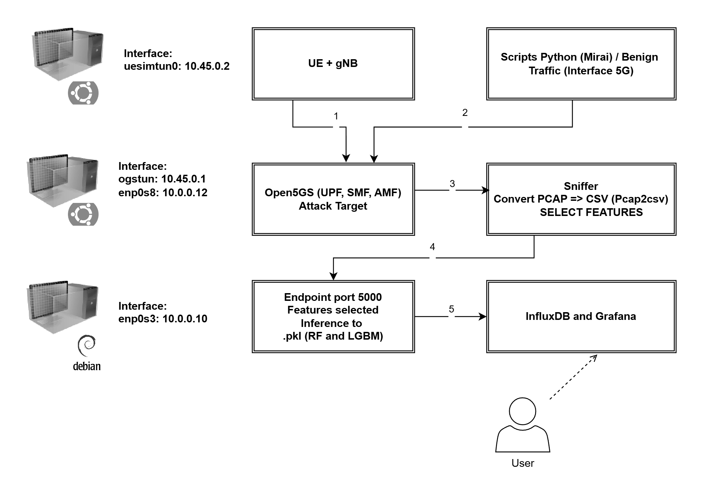

# Machine Learning for Detecting Mirai Attacks in 5G IoT Networks


This repository contains the source code, scripts, and supporting materials for the Master’s dissertation entitled **"Machine Learning for Detecting Mirai Attacks in 5G IoT Networks"**, developed in the Graduate Program in Computer Science at the Federal University of Juiz de Fora (UFJF), Brazil.

## Overview

The project implements and validates a **flow-based Intrusion Detection System (IDS)** for 5G-enabled IoT networks, focusing on identifying variants of the **Mirai malware** (GRE-IP, GRE-ETH, and UDP Plain).  
The proposed solution introduces a **distributed Edge-Fog-Cloud architecture**, inspired by the **5G NWDAF function**, where real-time inference with **Machine Learning models (Random Forest and LightGBM)** is performed at the Fog layer to ensure low latency.

The practical validation was conducted in a functional 5G testbed using **Open5GS** for the Core network and **UERANSIM** to emulate both the User Equipment (UE) and the base station (gNB).



## Repository Structure

- **/data/**: Should contain the datasets. This folder is ignored by `.gitignore`, but the expected structure is `raw/` for `.pcap` captures and `processed/` for the generated `.csv` files.
- **/notebooks/**: Contains the Jupyter Notebook (`analise_e_treinamento.ipynb`) with the entire process of data analysis, model training, and evaluation.
- **/models/**: Contains the trained `.pkl` files for the Random Forest and LightGBM models (ignored by `.gitignore`).
- **/scripts/**: Python and Shell scripts for different project stages.
  - `01_captura_trafego/`: Continuous network traffic capture script.
  - `02_extracao_features/`: Scripts to convert PCAP files to CSV and send data to the analysis API.
  - `03_geracao_trafego/`: Scripts to simulate benign traffic and the three Mirai attack variants.
- **/server_ids/**: Source code for the inference server (`app.py`) implemented using Flask.
- **/testbed_config/**: Configuration files (`.yaml`) for the 5G environment (Open5GS and UERANSIM), essential for reproducibility.
- **/figures/**: High-quality figures and charts used in the dissertation.
- `requirements.txt`: List of all Python dependencies required to run the project.

## How to Reproduce the Experiment

### Prerequisites

- Virtualization environment (e.g., VirtualBox) with three configured VMs.  
- Python 3.8+ and `pip`.  
- Git.  
- Open5GS and UERANSIM installed and configured on their respective VMs.  
- Knowledge of network interface configuration on VMs.

### Steps

1. **Clone the repository:**
    ```bash
    git clone https://github.com/[YOUR-USERNAME]/dissertacao-ids-5g-mirai.git
    cd dissertacao-ids-5g-mirai
    ```

2. **Install Python dependencies:**
    It is recommended to create a virtual environment first.
    ```bash
    python -m venv venv
    source venv/bin/activate  # On Linux/macOS
    # venv\Scripts\activate    # On Windows

    pip install -r requirements.txt
    ```

3. **5G Testbed Configuration:**
    - Use the configuration files in `/testbed_config/` to set up Open5GS (for the Core and UPF VMs) and UERANSIM (for the Client VM).

4. **Model Training (Optional):**
    - To train models from scratch, run the Jupyter Notebook `notebooks/analise_e_treinamento.ipynb`.  
      Pre-trained models are available in the `/models/` folder.

5. **Running the Detection Pipeline:**
    a. On the **IDS Server VM**, start the inference API:
       ```bash
       python server_ids/app.py
       ```
    b. On the **5G Core VM**, start traffic capture on the `ogstun` interface:
       ```bash
       sudo ./scripts/01_captura_trafego/detect_loop.sh
       ```
    c. On the **Client VM**, run one of the traffic generation scripts to simulate an attack:
       ```bash
       sudo python scripts/03_geracao_trafego/attack_GRE_IP.py
       ```
    d. After the capture, process the generated `.pcap` file for classification:
       ```bash
       python scripts/02_extracao_features/sniffer.py /path/to/captured_pcap.pcap
       ```


## Third-party tools and dataset generation

The `pcap2csv` tool used in this project is provided by the **Canadian Institute for Cybersecurity (CIC)** and was obtained from the dataset-generating paper that produced the dataset used to train the models. When reproducing the experiments, please consult the original CIC publication and repository for details on `pcap2csv`, its usage, and licensing requirements.

## Virtual Machine Specifications

The testbed was deployed on three virtual machines (VMs) running on Oracle VM VirtualBox. The specifications used during the experiments are listed below:

| Component | Specification |
|---:|---|
| **VM 1: IDS Server** | **Role:** Data analysis, inference API (Fog), InfluxDB, Grafana<br>**IP address:** `10.0.0.10`<br>**OS:** Debian (64-bit)<br>**RAM:** 6937 MB<br>**Storage (HD):** 80 GB |
| **VM 2: 5G Core / Collector** | **Role:** 5G Core (Open5GS), capture and feature extraction<br>**IP address:** `10.0.0.12`<br>**OS:** Ubuntu (64-bit)<br>**RAM:** 2048 MB<br>**Storage (HD):** 50 GB |
| **VM 3: Client / Attacker** | **Role:** 5G Client (UERANSIM), traffic generation<br>**IP address:** `10.0.0.11`<br>**OS:** Ubuntu (64-bit)<br>**RAM:** 2048 MB<br>**Storage (HD):** 50 GB |


## Results

The results demonstrated that both Random Forest and LightGBM models achieved **very high effectiveness** in detecting Mirai attacks, with **F1-Scores above 97%**.  
However, LightGBM proved to be significantly more efficient, with an **average inference latency nearly 8× lower**, making it the ideal choice for real-time implementation in resource-constrained environments such as the Fog layer.

For detailed analysis, please refer to the dissertation.

## Citation

If this work contributes to your research, please cite it as follows:

```
Barboza, M. V. Z. (2026). Machine Learning for Detecting Mirai Attacks in 5G IoT Networks. [Master’s Dissertation, Federal University of Juiz de Fora].
```

## License

This project is licensed under the MIT License. See the `LICENSE` file for more details.
